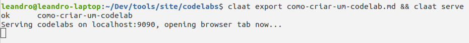

summary: Como criar um Codelab
id: como-criar-um-codelab
categories: Android
tags: tutorial, codelab
status: Published
authors: Leandro Leite
Feedback Link: http://google.com

# Como criar um Codelab

## Instalar os softwares necessários

Três softwares são necessários para criar um Codelab: `Go`, `Node.js` e `claat`

### Linguagem de programação Go

- Baixar pelo [site oficial](http://golang.org/dl)

- Extrair o conteúdo da pasta compactada no diretório padrão `/usr/local/go`

- Configurar as seguintes variáveis de ambiente:

    ```
    GOROOT=/usr/local/go
    GOPATH=$HOME/go
    PATH=$GOPATH/bin:$GOROOT/bin:$PATH

    ```

### Ambiente de execução Node.js (versão 10+)         
Baixar pelo [site oficial](http://nodejs.org/en/download) 

ou no Ubuntu pelo comando: 

```
$ sudo apt install nodejs npm
```

### claat: a ferramenta de linha de comando do Codelabs

Com o Go já configurado, execute o seguinte comando: 

```
go get github.com/googlecodelabs/tools/claat
```

O binário do `claat` estará em `~/go/bin`. Caso seja necessário, dê permissão de execução ao arquivo com o comando `chmod +x claat`

## Executar o projeto de Codelabs da Concrete localmente

1. Clonar o projeto através do comando `git clone https://github.com/concretesolutions/concrete-codelabs.git`

1. Ir até o diretório `site` dentro do projeto clonado

1. Executar o comando `npm install` para instalar as dependências do projeto clonado

1. Executar o comando `sudo npm install -g gulp-cli` para instalar globalmente o `Gulp`, automatizador de tarefas em JavaScript responsável por preparar e servir o projeto localmente

1. Executar o comando `gulp serve` para servir localmente o projeto no endereço padrão `http://localhost:8000`
    <br><br>
    
    <br><br>
1. Acessar o endereço `http://localhost:8000` no navegador e ver o site hospedado localmente

    TODO: foto do site sem nenhum Codelab criado

## Criar seu primeiro Codelab

### Criando o Codelab

Começamos criando um arquivo Markdown no diretório `codelabs` dentro do diretório `site`

```
$ touch meu-primeiro-codelab.md
```

Obs.: evitar usar espaços e caracteres especiais no nome do arquivo

### Estruturando o Codelab

Um Codelab possui uma estrutura básica encabeçada por seus dados de identificação. Para criar um Codelab, basta seguir o modelo:

```
summary: Meu Primeiro Codelab
id: meu-primeiro-codelab
categories: Android
tags: android, tutorial, codelab
status: Published
authors: Leandro Leite
Feedback Link: http://github.com/cs-leandro-leite
```

É uma boa prática que a id do seu Codelab seja igual ao nome do seu arquivo sem a extensão e o seu *Summary* seja a escrita natural da id/nome do arquivo.

O `status: Published` é padrão para todos os Codelabs que criaremos aqui, pois todos estarão em estado "Publicado".

O *Feedback Link* é um link usado para reportar bugs encontrados no codelab.

### Adicionando conteúdo

O título do seu Codelab será definido pelo header principal do seu arquivo Markdown

```
# Meu Primeiro Codelab
```

Cada passo do seu Codelab será definido pelos headers secundários do seu arquivo Markdown

```
## Meu primeiro passo
Duration: 1
```

O campo `Duration` e seu valor são traduzidos como a duração do passo do seu Codelab em minutos. Caso esse campo seja descrito em todos os passos, o seu Codelab terá um tempo total estimado e isso será exibido ao leitor conforme o mesmo for avançando. 

É possível fazer comentários no Markdown do seu Codelab usando comentários HTML

```
<!-- Esse é o primeiro passo do meu primeiro Codelab -->
## Meu primeiro passo
Duration: 1
```

Caso seja necessário usar imagens durante a criação do Codelab, opte por baixar e disponibilizar essas imagens em um diretório interno ao diretório `assets` com o mesmo nome do seu arquivo *.md


### Resultado

Após toda a escrita, o seu Codelab deve ter uma estrutura parecida com este exemplo:

```
summary: Meu Primeiro Codelab
id: meu-primeiro-codelab
categories: Tutorial
tags: codelab, tutorial
status: Published
authors: Leandro Leite
Feedback Link: http://github.com/leanite

# Meu Primeiro Codelab

<!-- Esse é o primeiro passo do meu primeiro Codelab -->
## Meu primeiro passo
Duration: 1

Am ameno dore latiremo, me matiremo omenare reo latire. Me dimere matiro omenare ameno interimo reo dori latiremo. Emulari dori am reo adapare, imperavi me matiremo latiremo.  
Me interimo reo dori am, matiremo dore dimere dori me. Reo emulari imperavi adapare latiremo, interimo dore am omenare. Omenare dimere me interimo matiro, dori imperavi latiremo matiremo. Interimo matiremo dore emulari adapare, am ameno latiremo dimere.

<!-- Esse é o segundo passo do meu primeiro Codelab -->
## Meu segundo passo
Duration: 3

Am ameno dore latiremo, me matiremo omenare reo latire. Me dimere matiro omenare ameno interimo reo dori latiremo. Emulari dori am reo adapare, imperavi me matiremo latiremo. Me interimo reo dori am, matiremo dore dimere dori me.  
Reo emulari imperavi adapare latiremo, interimo dore am omenare. Omenare dimere me interimo matiro, dori imperavi latiremo matiremo. Interimo matiremo dore emulari adapare, am ameno latiremo dimere.

<!-- Esse é conclusão do meu primeiro Codelab -->
## Conclusão
Duration: 1

Tchau o/

```

## Visualizar seu primeiro Codelab

### Exportando seu Codelab

Após finalizar a escrita do seu arquivo Markdown, volte para o diretório `codelabs` e execute o seguinte comando:

```
$ claat export como-criar-um-codelab.md
```

Ao exportar o seu Markdown, o `claat` irá gerar um diretório com o mesmo nome do seu arquivo *.md com os arquivos do seu Codelab


Para servir novamente o site localmente, volte ao diretório `site` e execute o `gulp` com um parâmetro extra indicando o diretório `codelabs`, onde está o seu Codelab recém exportado

```
$ gulp serve --codelabs-dir=codelabs
```

Acesse novamente o endereço `http://localhost:8000` no navegador e veja o site hospedado localmente exibindo o seu Codelab na página principal

TODO: print aqui

## Ganhar produtividade ao escrever um Codelab

Escrever um documento em Markdown pode trazer algumas surpresas no resultado final, mesmo com os plugins de pré-visualização de Markdown que existem em alguns editores de texto. Existe uma maneira de visualizar o resultado final do seu Codelab sem ter que fazer todos os passos necessários para publicação final.

Normalmente, escrevemos o arquivo *.md, usamos o `claat` para exportar e gerar o diretório com o arquivo *.html e reiniciamos o servidor que o Gulp está rodando. Podemos simplificar esse passo usando o comando `claat serve` no diretório `codelabs`. Esse comando faz com que o claat inicie um servidor local apenas para disponibilizar os Codelabs do diretório corrente, ignorando a estrutura do site que armazena os codelabs.

```
$ cd codelabs
$ claat export como-criar-um-codelab.md && claat serve

```



O `claat` servirá o diretório `codelabs` no endereço `http://localhost:9000` e abrirá uma nova aba no seu navegador automaticamente ao executar o comando `claat serve`.


Para visualizar o seu Codelab, basta clicar no diretório que foi exportado pelo `claat`


Obs.: o `claat` não possui *hot reload*, ou seja, toda vez que uma alteração for feita, é necessário parar o servidor, exportar novamente o arquivo *.md e iniciar o serviço novamente através do comando `claat export como-criar-um-codelab.md && claat serve`.

## Extra: abrindo um Pull Request para o repositório da Concrete

## Bônus: dicas úteis de Markdown