summary: Conceitos de modularização
id: conceitos-de-modularizacao
categories: Android
tags: tutorial, codelab
status: Published
authors: Leite & PH
Feedback Link: http://google.com

# Conceitos de modularização

## Motivação

Um módulo nada mais é do que um conjunto de código e e configurações de compilação que permitem dividir o projeto em unidades de diferentes funcionalidades. O projeto pode ter um ou mais módulos, e um módulo pode usar outro como dependência, de forma que cada módulo pode ser individualmente compilado, testado e *debuggado*.

Com essa divisão em unidades de diferentes funcionalidades, podemos ajudar o nosso projeto a atingir princípios da engenharia que são bastante difundidos, como o princípio da responsabilidade única (S do SOLID) e o princípio da inversão de dependência (D do SOLID).

Focando apenas na estrutura de um projeto, sem mencionar os ganhos de performance, a modularização pode ajudar bastante a manter as dependências e a arquitetura do projeto organizadas. É muito mais fácil violar uma regra arquitetural simplesmente importando uma classe de outro *package* na sua classe atual e seguir o seu fluxo de desenvolvimento sem pensar em uma solução melhor. Quando módulos trabalham isolados, para usar uma classe de outro módulo, devemos ou importar e assumir a dependência desse módulo, ou criar uma forma indireta de comunicação. E é exatamente isso que veremos nesse Codelab!

## Criando um módulo Android

Para criar um módulo novo, devemos ir até **File**, depois selecionar **New** e finalmente **New Module...**.

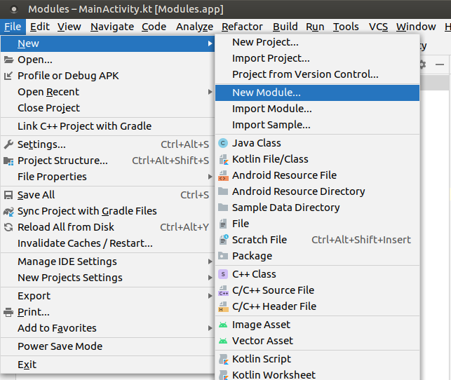

Na nova janela que abriu, selecione a opção **Android Library**.

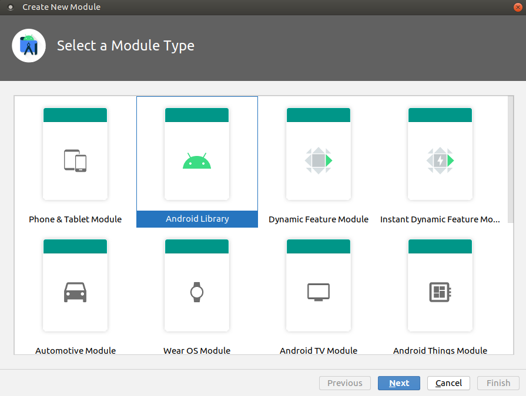

Em seguida, dê um nome ao módulo a ser criado e confira se o seu package condiz com o projeto.

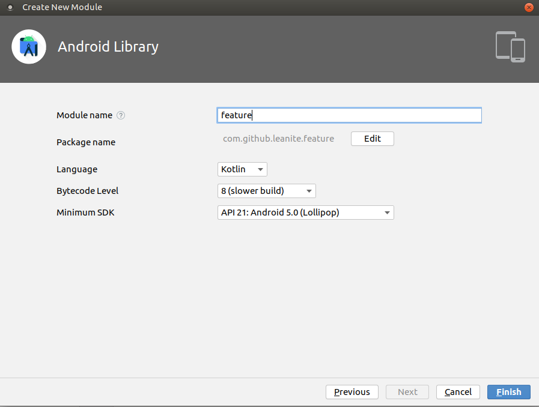

Ao clicar em **Finish**, o módulo e seus arquivos serão criados no projeto!

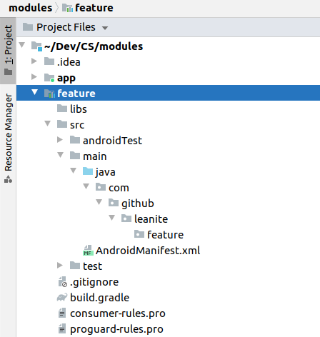

Alguns arquivos como `.gitignore`, `consumer-rules.pro` e `proguard-rules.pro`, assim como o diretório `libs`, podem ser dispensáveis ao módulo se tiverem as mesmas configurações que o módulo principal do projeto, ou simplesmente não tiver nenhuma necessidade de mudança. No caso do nosso exemplo, podemos remover esses arquivos sem problemas do nosso novo módulo criado. 

## Estrutura de um módulo

O módulo que criamos possui a estrutura semelhante ao módulo principal **app**.


Ele possui um arquivo `build.gradle` com as suas configurações de build e um `AndroidManifest.xml` para declarar permissões, Activities, entre outros, exatamente da mesma forma do módulo app.

Especificamente sobre o `build.gradle`, é uma boa prática tornarmos comuns algumas configurações entre os módulos da aplicação. Por exemplo, se cada módulo tiver o seu próprio `compileSdkVersion`, a cada update do SDK Android nós teremos que alterar em todos os arquivos de todos os módulos. Pensando nessa e em outras possíveis alterações, é recomendado configurar o `build.gradle` raíz, o da raíz do projeto que está fora do módulo app, com todas as configurações comuns aos módulos.

**build.gradle raíz**
```
buildscript {
    ...
}

allprojects {
    ...
}

task clean(type: Delete) {
    delete rootProject.buildDir
}

subprojects {
    afterEvaluate { project ->
        if (project.plugins.findPlugin('android') ?: project.plugins.findPlugin('android-library')) {
            android {
                compileSdkVersion 30
                buildToolsVersion "30.0.2"

                defaultConfig {
                    minSdkVersion 21
                    targetSdkVersion 30
                    versionCode 1
                    versionName "1.0"
                    testInstrumentationRunner "androidx.test.runner.AndroidJUnitRunner"
                }

                buildTypes {
                    release {
                        minifyEnabled false
                        proguardFiles getDefaultProguardFile('proguard-android-optimize.txt'), 'proguard-rules.pro'
                    }
                }
                compileOptions {
                    sourceCompatibility JavaVersion.VERSION_1_8
                    targetCompatibility JavaVersion.VERSION_1_8
                }
                kotlinOptions {
                    jvmTarget = '1.8'
                }
            }
        }
    }
}
```

Basicamente estamos incluindo um bloco que indica que para todos os subprojects, que são os módulos do nosso projeto, configurados com os plugins `android` ou `android-library`, setaremos as configurações especificadas no bloco `android{}`. É importante ressaltar que o módulo **app** também é um subproject.

O `applicationId` configurado em um projeto deve ser único. Por esse motivo, devemos deixar somente esta configuração no `build.gradle` do módulo principal **app** e removê-la de todos os outros módulos.

**app/build.gradle**
```
plugins {
    id 'com.android.application'
    id 'kotlin-android'
}

android {
    defaultConfig {
        applicationId "com.github.leanite.modules"
    }
}

dependencies {
    ...
}
```

E, com a configuração geral, o nosso módulo recém criado fica com o `build.gradle` bem reduzido, apenas com as suas dependências.

**feature/build.gradle**
```
plugins {
    id 'com.android.library'
    id 'kotlin-android'
}

dependencies {
    ...
}
```

Finalmente, para que o módulo **app** use o módulo **feature** como dependência, basta alterar o `build.gradle` do módulo **app**.

**app/build.gradle**
```
plugins {
    id 'com.android.application'
    id 'kotlin-android'
}

android {
    defaultConfig {
        applicationId "com.github.leanite.modules"
    }
}

dependencies {
    implementation project(':feature')
    ...
}
```

Importante: o arquivo `settings.gradle` possui a configuração de inclusão de todos os módulos do projeto. Sempre devemos conferir se os módulos estão sendo corretamente referenciados nesse arquivo.

**settings.gradle**
```
include ':feature'
include ':app'
rootProject.name = "Modules"
```

## Dependência entre os módulos

Quando temos mais de um módulo no projeto, é comum surgirem partes do código de um módulo que necessitam ser usadas por outros módulos. Devemos avaliar bastante se importar um módulo como dependência de outro é o caminho mais viável, levando em conta a manutenção do código, escalabilidade, preparo para mudanças, entre outros fatores comuns na engenharia de software.

Vamos supor que existam dois módulos, o **módulo A** e o **módulo B**. Se o módulo A necessita utilizar uma classe do módulo B, assim como o módulo B necessita utilizar uma classe do módulo A, é um sinal que devemos repensar a nossa implementação. Situações como essa caracterizam uma **dependência circular** e isso não é permitido. Se importamos o módulo B como uma dependência do módulo A é vice-versa, teremos um erro de compilação acusando dependência circular entre os módulos.

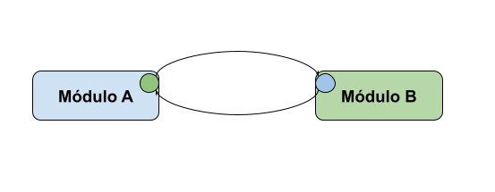

O esquema acima ilustra a situação que descrevemos anteriormente: o módulo A possui uma parte de código que interessa ao módulo B e vice-versa. É uma prática muito comum resolver esse impasse extraindo os códigos necessários e colocándo eles em um terceiro módulo comum. 

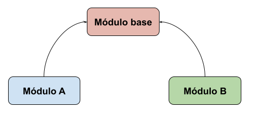

Dessa forma, o novo **módulo base** possui o código que interessa aos outros módulos e torna possível o seu uso tanto no módulo A quanto no módulo B. Isso significa que o módulo base pode, sem nenhum problema, ser uma dependência tanto do módulo A quanto do módulo B.

Existe uma variedade de códigos que são comuns aos módulos de um projeto. Geralmente, são os códigos de serviços de API, modelos de negócio, componentes de UI, strings e dimens, extension functions, entre outros. É uma boa prática criar módulos separados para cada tipo de código que precisa ser reutilizado. Quanto mais específico for o módulo, menor a chance de ocorrer uma dependência circular, além de contribuir com a manutenção do código, escalabilidade e saúde do projeto.

## Criando submódulos

Em determinadas situações, é comum ser necessária a criação de submódulos em um módulo do projeto. Por exemplo, se estamos modularizando um conjunto de código comum, muitas vezes temos um módulo **core** com possíveis submódulos como **base**, **network**, **model**, entre outros.

Supondo que já criamos um módulo chamado **core**, da mesma forma que foi feito anteriormente, vamos criar um submódulo **base**.

Primeiro, com o módulo **core** selecionado, clicamos em **New** e, em seguida, **Module**. Vamos selecionar, novamente, a opção **Android Library**.

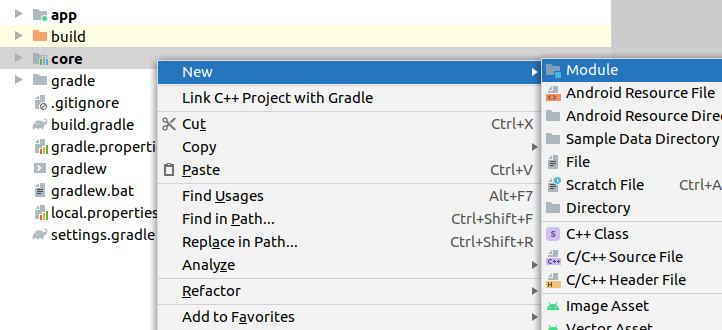

Ao nomear o módulo, devemos manter o prefixo `:core`, o que garante que o módulo **base** será um submódulo do módulo **core**. Isso significa que o seu name será `:core:base`. 

Também devemos nos atentar ao **package** do submódulo. Por padrão, o package vem apenas com o nome do submódulo, ou seja, apenas base. É uma boa prática colocarmos o package com a mesma estrutura presente nos módulos, ou seja, **`[package].core.base`** e não simplesmente `[package].base`.

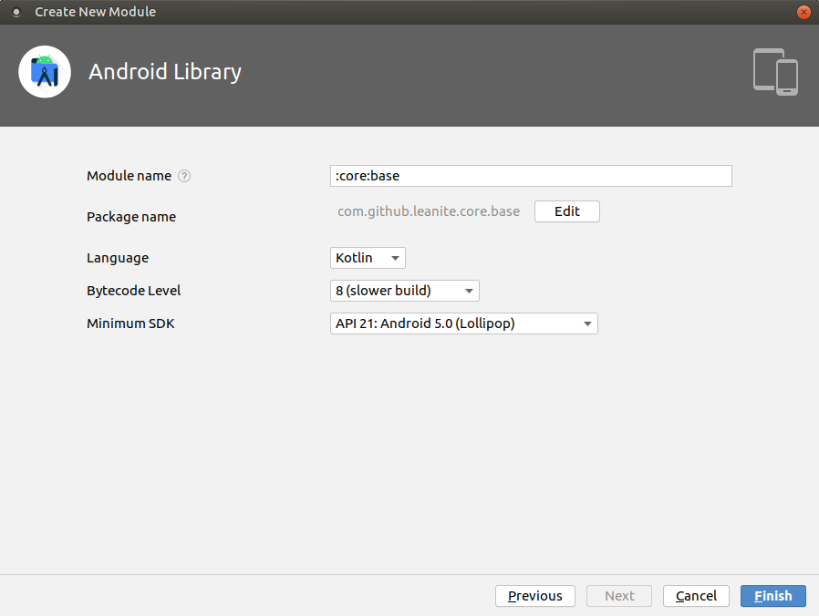

Feito isso, nosso submódulo está criado! É possível vê-lo dentro da estrutura do módulo **core** e seu import no arquivo `settings.gradle`.

## Comunicação entre módulos

Em determinadas situações, como desenvolvedores, queremos utilizar alguma funcionalidade de um módulo, mas não queremos fazer o import completo de todas as classes e particularidades desse módulo.

Vamos supor o seguinte exemplo: temos uma feature que necessita de duas validações, uma para saber se uma String é um telefone de celular válido e outra para saber se uma String é um nome completo. Vamos criar os módulos e modelar a solução da seguinte forma:

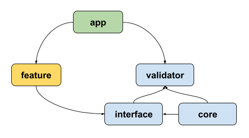

Interpretando o diagrama acima, temos que o módulo **app** tem como dependência os módulos **feature** e **validator**. O módulo **validator** possui, e também tem como dependência, os seus dois submódulos **interface** e **core**. O submódulo **core** tem como dependência o submódulo **interface**. Finalmente, o módulo **feature** tem como dependência o submódulo **interface** de **validator**.

### Módulo app

O módulo app apenas inicializará o Koin, já que a injeção de dependência tem um papel fundamental nessa comunicação.

**MyApplication.kt**
```
class MyApplication : Application(){
    override fun onCreate() {
        super.onCreate()
        startKoin{
            androidLogger()
            androidContext(this@MyApplication)
            modules(appModule)
        }
    }
}

val appModule = listOf<Module>(
    validatorModule,
    featureModule
)
```

### Módulo validator

Dividimos o módulo validator em dois submódulos: core e interface. O submódulo interface tem o contrato necessário para usar um validador, enquanto o módulo core possui a lógica dos validadores.

No módulo **interface**, temos apenas uma interface `Validator`.

**Validator.kt**
```
interface Validator {
    fun validateFullName(value: String): Boolean
    fun validatePhone(value: String): Boolean
}
```

No módulo **core**, temos duas classes, `PhoneValidator` e `FullNameValidator`.

**PhoneValidator.kt**
```
class PhoneValidator {
    fun isValidPhone(phone: String): Boolean =
        phone.matches(Regex("^\\([1-9]{2}\\) 9\\d{4}-\\d{4}\$"))
}
```

**FullNameValidator.kt**
```
class FullNameValidator {
    fun isFullName(name: String): Boolean {
        return isGreaterTwoNames(splitName(name.trim())) &&
                isGreaterTwoCharacters(splitName(name.trim())) &&
                !hasSpecialCharacters(splitName(name.trim())) &&
                !hasNumbers(splitName(name.trim()))
    }

    ...
}
```

Para utilizar a implementação dessas duas classes e também implementar a interface `Validator` do submódulo interface, temos a classe `ValidatorImpl`.

**ValidatorImpl.kt**
```
class ValidatorImpl(
    private val fullNameValidator: FullNameValidator,
    private val phoneValidator: PhoneValidator
) : Validator {

    override fun validateFullName(value: String): Boolean =
        fullNameValidator.isFullName(value)

    override fun validatePhone(value: String): Boolean =
        phoneValidator.isValidPhone(value)
}
```

Finalmente, a única coisa presente no módulo **validator** é o módulo de injeção do Koin.

**ValidatorModule.kt**
```
val validatorModule = module {
    single { FullNameValidator() }
    single { PhoneValidator() }
    single { ValidatorImpl(get(), get()) } bind Validator::class
}
```

Importante reparar que é aqui nesse módulo do Koin que a magia acontece. Estamos expondo apenas uma interface de comunicação através do submódulo **interface**, porém a injeção de dependência garante que onde for requisitada a dependência de `Validator`, retornaremos uma instância de `ValidatorImpl`.

### Módulo feature

O módulo **feature** possui a `FeatureActivity` e o `FeatureViewModel`, além do módulo do Koin `FeatureModule`, para utilizar a validação do módulo **validator**.

É no `FeatureViewModel` que utilizamos o módulo **validator** sem conhecer de fato as suas implementações. A injeção de dependência garante que será utilizada a implementação da interface `Validator` como vimos anteriormente.

**FeatureViewModel.kt**
```
class FeatureViewModel(
    private val validator: Validator
) : ViewModel() {

    fun isFullName(name: String) = validator.validateFullName(name)

    fun isPhoneValid(phone: String) = validator.validatePhone(phone)
}
```

Por último, temos a `FeatureActivity` e o `FeatureModule`. A `FeatureActivity` usará o `FeatureViewModel` para validar os seus campos de texto relativos ao número de telefone celular e nome completo.

**FeatureActivity.kt**
```
class FeatureActivity : AppCompatActivity() {

    private val viewModel: FeatureViewModel by viewModel()

    ...

    private fun enableConfirmButton() {
        buttonConfirm.isEnabled = 
            viewModel.isFullName(editTextFullName.text.toString()) &&
            viewModel.isPhoneValid(editTextPhone.text.toString())
    }
}
```

O `FeatureModule` é o módulo de injeção do Koin.

**FeatureModule.kt**
```
val featureModule = module {
    viewModel { FeatureViewModel(get()) }
}
```

## Caso real: resolvendo problemas de navegação

Quando temos features em diferentes módulos, um desafio muito comum que temos que enfrentar é a navegação entre fluxos de funcionalidades diferentes. Por exemplo, vamos supor um projeto em que existam duas features em dois módulos separados, Login e Tela Principal. Uma vez que um usuário passe pela tela de login e tenha sucesso, ele deveria ser redirecionado para a tela pricipal da aplicação. Como podemos fazer essa operação se a tela principal e o login estão em módulos diferentes que não devem ter dependência entre eles?

A solução pode ser bem parecida com o exemplo que vimos no passo anterior. Vamos modelar uma possível solução: o módulo **base** possui um módulo **navigation** com todas as interfaces de navegação do projeto. Cada módulo de feature tem como dependência o módulo navigation e utiliza uma interface de navegação para fazer uma implementação dessa interface que navegue para suas Activities ou Fragments locais. A injeção de dependência irá garantir que cada implementação seja usada de forma correta em cada ViewModel que utilize essas interfaces nos seus construtores.

É muito comum uma Activity ou Fragment necessitar de um objeto como parâmetro para que seu conteúdo seja criado de acordo com informações dinâmicas. No caso das Activities, enviamos esses objetos via `Intent` e necessitamos ter a classe dessas instâncias mapeadas na interface de navegação. Nesse ponto, devemos tomar uma decisão arquitetural quanto aos modelos da nossa aplicação: teremos um sub módulo **model** dentro do módulo **base** comum a todas as features ou utilizaremos objetos de fronteiras de módulos garantindo que cada modelo pertença apenas à sua respectiva feature?

**sub módulo model em base**

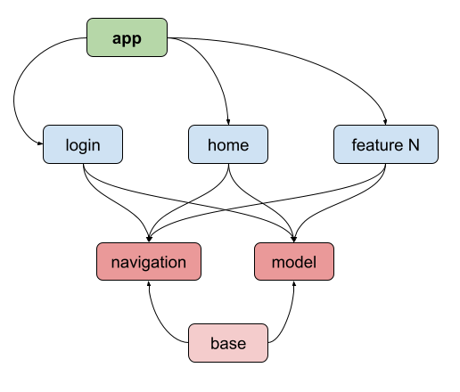

**objetos de fronteira e models separados**

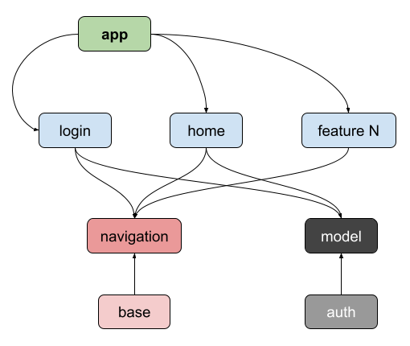

Para o primeiro cenário, mais simples, temos:

**HomeNavigation.kt em base/navigation**
```
interface HomeNavigation {
    fun openHome(context: Context, user: User)
}
```

**User.kt em base/model**
```
@Parcelize
data class User(
    val id: Int,
    val fullName: String,
    val email: String
)
```

Para o segundo cenário, utilizando os objetos de fronteiras, temos:

**HomeNavigation.kt em base/navigation**
```
interface HomeNavigation {
    fun openHome(context: Context, homeBundle: HomeBundle)
}

@Parcelize
data class HomeBundle(
    val userId: Int
)
```

**User.kt em auth/model**
```
@Parcelize
data class User(
    val id: Int,
    val fullName: String,
    val email: String
)
```

Vale ressaltar que são duas formas equivalentes de resolver o mesmo problema. Cada projeto, de acordo com as suas particularidades, pode se adequar melhor a uma das soluções propostas. Independente de qual solução arquitetural vamos adotar, o resto da solução é basicamente o mesmo!

No módulo **home**, teremos uma implementação de `HomeNavigation` do módulo **navigation**.

**HomeNavigationImpl.kt em home**
```
class HomeNavigationImpl : HomeNavigation {
    override fun openHome(context: Context, user: User) {
        val intent = Intent()

        intent.putExtra(HomeActivity.USER_EXTRA, user)

        context.startActivity(intent)
    }
}
```
ou
```
class HomeNavigationImpl : HomeNavigation {
    override fun openHome(context: Context, homeBundle: HomeBundle) {
        val intent = Intent()

        intent.putExtra(HomeActivity.HOME_BUNDLE_EXTRA, homeBundle)

        context.startActivity(intent)
    }
}
```

No módulo **login**, teremos um `ViewModel` que terá como dependência uma instância de `HomeNavigation`. A injeção de dependência irá garantir que esse `ViewModel` utilize uma instância de `HomeNavigationImpl` do módulo **home**.

**LoginViewModel.kt em login**
```
class LoginViewModel(
        private val homeNavigation: HomeNavigation
) : ViewModel() {
    fun openHome(context: Context, user: User) = homeNavigation.openHome(context, user)
}
```
ou
```
class LoginViewModel(
        private val homeNavigation: HomeNavigation
) : ViewModel() {
    fun openHome(context: Context, user: User) = homeNavigation.openHome(context, HomeBundle(user.id))
}
```

Com o `ViewModel` implementado, basta uma `Activity` ou um `Fragment` utilizar a navegação construída.

**LoginActivity.kt em login**
```
class LoginActivity : AppCompatActivity() {

    private val viewModel: LoginViewModel by viewModel()

    ...

    override fun setUpObservables() {
        viewModel.loginSuccess.observe(this, Observer {
            viewModel.openHome(context, /*...*/)
        })
    }
}
```

Não se esqueçam de implementar a injeção de dependência, como visto no passo anterior, para que tudo funcione corretamente. Uma vez que a injeção de dependência esteja correta, o problema de navegação entre features está resolvido!