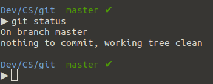

summary: Git básico na prática
id: git-basico-na-pratica
categories: Ferramentas
tags: treinamento, git, codelab
status: Published
authors: Leandro Leite
Feedback Link: http://google.com

## O que é Git?

O Git é um sistema distribuído de controle de versão utilizado pela grande maioria dos desenvolvedores atualmente. Com ele, podemos salvar nossas alterações sem de fato sobrescrever as versões anteriores, tornando possível ter um histórico de alterações de um projeto e também voltar e acessar qualquer momento na linha do tempo através de uma alteração específica.

Ser um sistema distribuído significa que todo desenvolvedor trabalhando em um repositório Git possui uma cópia inteira do projeto. Isso torna muito mais fácil controlar o fluxo de adições de código ao projeto, mesmo que elas sejam feitas por vários desenvolvedores ao mesmo tempo.

## Como funciona o Git

### Repositório (repo)

Um repositório do Git é um diretório com um conjunto de arquivos e suas diferentes versões devido às modificações que ocorreram ao longo do tempo. Cada colaborador de um projeto tem acesso ao seu repositório para baixá-lo em sua máquina e realizar suas modificações localmente para, então, submeter essas alterações.

### Pontos de verificação (commits)

Quase tudo no Git é feito através dos pontos de verificação do projeto, chamados de commits. Esses pontos são formados por um conjunto de alterações em um ou mais arquivos e uma mensagem que tem como objetivo descrever as modificações nesse determinado ponto.

### Ramificações (branches)

Uma ramificação, chamada de branch, representa uma linha de desenvolvimento independente. Podemos pensar nas branches como uma forma de criar um novo e limpo diretório de trabalho para adicionarmos nossas alterações e, em determinado momento como é comum acontecer, juntarmos em outra branch.

### Rótulos (tags)

Um rótulo, também chamado de tag, é usado para marcar determinados pontos importantes no histórico de modificações de um repositório. É muito comum marcarmos os commits de mudanças de versão de um projeto, por exemplo.

### Fluxo comum de trabalho no Git


Vamos interpretar a imagem acima juntos!

Existem 5 branches na imagem de exemplo: `master`, `develop`, `feature-A`, `bugfix` e `feature-B`. Também existem 3 tags `v1`, `v2` e `v3` na imagem, além de diversos commits representados pelos círculos em cada branch.

No dia 1, o ponto inicial do projeto, a branch `master` está vazia, pois não existe nenhum release em produção. A branch `develop` tem a versão inicial com a estrutura do projeto e a branch `feature-A` teve seu início a partir do código presente na branch `develop`. A feature A é desenvolvida e, ao seu término, seu código é agregado ao código da branch `develop`, que também envia seu código para a branch `master`, gerando o release com a tag `v1`.

Em um segundo momento, é iniciado o desenvolvimento da feature B na branch `feature-B` a partir da branch `develop`. Durante o desenvolvimento dessa feature, em um terceiro momento, um bug é encontrado na `develop` e sua correção é iniciada na branch `bugfix`. O bug é resolvido e seu código de correção é enviado para a `develop` e em seguida para a `master`, gerando o release com a tag `v2`. Repare que o bug foi resolvido antes do término da implementação da feature B e o código base da branch `develop` foi atualizado, fazendo com que a branch `feature-B` não esteja mais sincronizada com a `develop`, sendo então necessário fazer esse *sync* antes do término e envio do código para gerar o release `v3`.

### Ciclo de vida e estados dos arquivos no Git


Cada arquivo no seu diretório de trabalho, também chamado de *working directory*, pode estar em um dos dois estados: rastreado e não rastreado (untracked). Os arquivos rastreados são os que foram incluídos em um determinado ponto do repositório e possuem três estados: não modificado (unmodified), modificado (modified) e preparado (staged). Os arquivos não rastreados são aqueles que ainda não foram incluídos em nenhum ponto do repositório e também não estão na área de stage (staging area).

Quando um arquivo `untracked` é adicionado, ele se torna um arquivo `staged` (preparado), ficando na staging area aguardando o commit para se tornar um arquivo `tracked` e `unmodified` (rastreado e não modificado). Isso ocorre porque uma vez que o arquivo `staged` é commitado, o estado atual da branch passa a ser o do último commit e também a conter todas as últimas alterações desse arquivo, fazendo com que o mesmo se torne `unmodified` (não modificado).

Uma vez que um arquivo `unmodified` seja alterado, o Git o identificará como `modified`. Os arquivos modificados podem ser preparados, adicionados ao pacote de um commit, e se tornarem arquivos `staged`. Quando os arquivos que estão classificados como `staged` são commitados, eles se tornam `unmodified` pelo mesmo motivo visto no caso dos `untrackeds` anteriormente.

Caso um arquivo `unmodified` seja removido, esse arquivo deixará de existir no diretório de trabalho, se tornando também do tipo `untracked` (não monitorado).

## Configuração inicial


### Instalação

Caso ainda não tenha o Git instalado, basta usar o comando `sudo apt install git` para realizar a sua instalação no Ubuntu.

### Sua Identidade

A primeira coisa que você deve fazer ao instalar Git é configurar seu nome de usuário e endereço de e-mail. Esses dados são usados a cada commit para determinar a sua autoria. Podemos fazer isso através dos comandos abaixo:

```
$ git config --global user.name "Fulano de Tal"
$ git config --global user.email fulanodetal@exemplo.br
```

Importante: a opção `--global` garante que seu usuário e e-mail serão usados, por padrão, em todos os repositórios em que você commitar. Caso seja necessário alterar essas informações para um repositório específico, basta ir até o diretório desse repositório e executar os comandos acima sem a opção `--global`.

### Configurando o editor padrão

Podemos escolher o editor de texto padrão que será utilizado quando o Git precisar que editemos uma mensagem ou um arquivo texto. Se não for configurado, o Git usará o editor padrão, que pode variar de acordo com o Sistema Operacional. Para configurar o editor de texto padrão, basta usar o comando abaixo:

```
$ git config --global core.editor [seu editor aqui]
```

## Operações fundamentais

### Inicializando um repositório local

Para inicializar um repositório vazio, basta utilizar o comando `git init` no diretório em que deseja criar o repositório. Um novo subdiretório oculto `.git` será criado com todos os arquivos e a estrutura de diretórios internos necessários para o versionamento do seu repositório funcionar corretamente.


### Estado atual do repositório

O comando `git status` nos informa como está o estado atual do nosso repositório remoto, ou seja, em que `branch` estamos operando, se existe algum arquivo novo ou alterado, se existem arquivos preparados para serem commitados, se estamos sincronizados com o repositório, entre outras possibilidades.


### Gravando alterações no repositório

O comando `git add` adiciona arquivos do diretório de trabalho, tanto rastreados e modificados quanto os não rastreados, à área de stage. Quando adicionamos arquivos, eles se tornam preparados para serem commitados.


Tanto o comando `git add README.md hello_world.c` quanto o comando `git add .` podem ser utilizados para adicionar e preparar todos os arquivos que foram alterados ou não são rastreados. A diferença entre esses comandos é que o `git add .` é mais prático, pois recebe como argumento o ponto `.`, que significa **diretório atual**. Quando adicionamos um diretório, por padrão, todos os seus arquivos e pastas modificados também são adicionados recursivamente.

Importante: ao usar `git add .` devemos sempre ter a atenção de avaliar com o comando `git status` se realmente todos os arquivos que estão marcados como novos ou alterados devem ser de fato preparados para o commit.

Após prepararmos os arquivos, usamos o comando `git commit` para submeter as nossas alterações ao repositório. É aberto o editor padrão para que possamos escrever a mensagem de commit, que é obrigatória e sem ela o commit é cancelado. Podemos utilizar também o comando `git commit -m [mensagem]` para realizar um commit com a mensagem `[mensagem]` sem ter que abrir o editor padrão, de forma mais rápida e prática.


Em resumo, é da forma a seguir que ocorrem as mudanças de estado no Git:


### Acessando o histórico de commits

Para acessar o histórico de commits, podemos usar o comando `git log`.


Podemos adicionar algumas opções ao comando para filtrar ou facilitar a visualização do histórico de commits. Por exemplo, se adicionarmos a opção `--oneline`, o comando mostra o histórico de commits de forma simplificada.

`git log --oneline`


Também podemos filtrar os commits por autor utilizando a opção `--author` como em `git log --author=Pedro`:


Muitas vezes queremos saber o histórico de alterações de um arquivo do nosso repositório. Para isso, podemos usar o comando `git log --follow [arquivo]`. Por exemplo, abaixo temos uma possível saída para o comando `git log --follow LoginActivity.kt`:


## Fazendo bons commits

### Escrevendo mensagens de commit nos padrões da comunidade

Uma mensagem de commit é dividida em, pelo menos, duas partes importantes: assunto e corpo da mensagem. Um commit deve ter, pelo menos, o assunto da mensagem, que **não deve exceder 50 caracteres**. Um indicativo de que o commit necessita de um corpo de mensagem é que seu assunto está estourando o seu limite de 50 caracteres. Algumas comunidades aumentam esse limite de 50 caracteres para 72 caracteres, mas nunca excedem o limite de 72 caracteres.

O assunto do commit tem algumas particularidades importantes que devem ser respeitadas. A principal é o seu modo verbal, todo assunto de commit é escrito de forma imperativa. Por exemplo, não escrevemos "Corrigindo bug #234" ou "Corrigimos bug #234", e sim **"Corrige o bug #234"**. Além disso, existe o limite de 50 a 72 caracteres que falamos anteriormente, a convenção de pular uma linha entre o assunto e o corpo da mensagem e não usar ponto final no assunto do commit.

Sobre o corpo do commit, não existe uma convenção sobre o tamanho total do corpo. Ele pode ser tão detalhado quanto um determinado commit necessitar, porém é uma boa prática, e um pedido da comunidade, quebrar linhas a cada 80 caracteres para facilitar a leitura em um terminal clássico.

O motivo para todas essas regras é garantir a legibilidade e o entendimento quando determinada pessoa revisitar o seu commit. Ela irá ler a sua mensagem de commit para descobrir o que aconteceu com o código naquele exato momento. Por exemplo:

Se aplicado, o que faz o commit d967462?

    commit d967462 (HEAD -> master)
    Author: Leandro Leite <leandro.leite@concrete.com.br>
    Date:   Tue Feb 23 18:30:00 2021 -0300

    Corrige um crash na tela de login

    Existia a possibilidade do campo email retornar null quebrando
    o contrato e causando um NullPointerException na LoginActivity.

A ideia é que o nosso assunto complete a frase "Se aplicado, este commit ...", que no nosso caso ficaria como **"Se aplicado, este commit corrige um crash na tela de login**. 

## Desfazendo alterações

Desfazer alterações é uma operação importante no Git. Nem sempre tudo sai como imaginamos, um arquivo que não deveria entrar no commit é submetido, queremos reverter o último commit, ir para um commit específico na linha do tempo, entre outras muitas situações que podem ocorrer. Aqui tentaremos mostrar as mais comuns.

### Deletando arquivos

O comando `git rm` serve para deletar arquivos do diretório de trabalho.  


Importante: caso o argumento do comando `git rm` seja um diretório, devemos utilizar a opção `-r`, semelhante ao comando `rm` que é bastante usado nos terminais.

### Removendo um arquivo da área de preparo

Supondo que um arquivo tenha sido alterado e preparado para o commit com o comando `git add`, podemos remover esse arquivo da área de preparo e fazer com que ele volte a ser apenas um arquivo modificado e candidato para commit. Para isso, usamos o comando `git reset`.


### Retornando commits

Podemos acessar um commit específico na linha do tempo e fazer com que os seus arquivos voltem para o diretório de trabalho como arquivos modificados. Para isso, devemos usar também o comando `git reset`, porém de uma forma um pouco diferente, passando como argumento a hash de um commit obtida pelo comando `git log` ou de acordo com alguma operação usando a referência `HEAD`.

Exemplo de um commit retornado pelo comando `git log`:

    commit d96746659346a2a8083c119e331d87c25dbed538
    Author: Leandro Leite <l.carneiro.leite@accenture.com>
    Date:   Tue Feb 23 18:30:00 2021 -0300

        Adiciona arquivos README e hello_world.c

A hash do commit é a string `d96746659346a2a8083c119e331d87c25dbed538` e é ela que usaremos como argumento para o comando `git reset`.


### Acessando commits

Podemos acessar um commit específico na linha do tempo e navegar para um estado antigo do projeto. Para isso, devemos usar o comando `git checkout` passando como argumento a hash de um commit obtida pelo comando `git log` ou de acordo com alguma operação usando a referência `HEAD`.

Usaremos a mesma hash do commit anterior, a string `d96746659346a2a8083c119e331d87c25dbed538`, como argumento para o comando `git checkout`.


Ao acessar um commit específico, recebemos a mensagem que estamos em no estado *detached HEAD*. Isso ocorre quando apontamos especificamente para um commit, ou seja, esse estado pode ser definido como um estado onde a referência HEAD não está apontando para algo com referência, como uma branch ou uma tag. É importante saber que se commitarmos alguma alteração em cima de uma *detached HEAD*, o Git continuará sem posicionar a HEAD em alguma referência e podemos perder essas alterações caso uma branch não seja criada.


### A referência HEAD

HEAD é um ponteiro que referencia um objeto de commit. Por padrão, quando está em um estado normal, essa referência é o último commit feito em uma branch. Quando a HEAD aponta para um commit sem referência, como por exemplo um commit histórico em uma branch, ela entra em estado *detached*.

Como, geralmente, a HEAD aponta para o último commit de uma branch, é muito comum utilizarmos o modificador `~` quando utilizamos essa referência. Esse modificador significa, basicamente, parente de um determinado grau. Por exemplo, a referência `HEAD~1` significa parente de primeiro grau do último commit de uma branch, ou seja, seu penúltimo commit. Da mesma forma que `HEAD~N` é o parante de n-ésimo grau do último commit.

```
$ git log --oneline

84fde99 (HEAD -> master) Adiciona function.c
d967466 Adiciona arquivos README e hello_world.c
aa1cf8d Adiciona README

$ git checkout HEAD~2

Note: checking out 'HEAD~2'.
You are in 'detached HEAD' state. (...)

HEAD is now at aa1cf8d Adiciona README
```

### Revertendo commits

É possível reverter um commit no Git, como se fosse uma operação de desfazer. Ao reverter um commit, o Git identifica as alterações do commit a ser revertido e cria um novo commit, que será o último da branch, desfazendo essas alterações. O comando para reverter um commit é o `git revert`.

```
$ git log --oneline

1c43838 (HEAD -> master) Adiciona graph.c
84fde99 Adiciona function.c
d967466 Adiciona arquivos README e hello_world.c
aa1cf8d Adiciona README


$ git revert 84fde99

[master a06f865] Revert "Adiciona function.c"
 2 files changed, 2 insertions(+), 2 deletions(-)

$ git log --oneline

a06f865 (HEAD -> master) Revert "Adiciona function.c"
1c43838 Adiciona graph.c
84fde99 Adiciona function.c
d967466 Adiciona arquivos README e hello_world.c
aa1cf8d Adiciona README
```

### Diferença entre reset e revert

A operação de reverter tem uma diferença principal quando comparada à operação de resetar. O ato de reverter não altera o histórico do projeto, sendo uma opção mais segura para os projetos que são compartilhados em um repositório remoto. Isso porque se revertemos um commit, um novo commit é criado revertendo as alterações desse commit, sem alterar o histórico do projeto. Se usamos o comando `reset`, o comportamento é bem diferente. Quando resetamos um commit, voltamos para esse commit na linha do tempo e removemos todos os commits que foram feitos depois desse commit alvo, sendo necessário commitar novamente qualquer alteração que tenha sido feita após esse determinado momento no histórico da branch. Em diversos casos, é uma operação muito custosa e inviável, por esse motivo o comando `revert` é mais utilizado no cenário citado.

### Desfazendo as modificações

Se executarmos o comando `git checkout` em um arquivo, caso ele esteja marcado como modificado, esse arquivo voltará ao seu estado original, ou seja, não alterado.


Obs: também podemos usar como argumento o diretório atual através do `.` com o comando `git checkout .` e desfazer todas as modificações de uma só vez.


## Ramificações do código: trabalhando com branches

Os repositórios do Git possuem a estrutura de uma árvore. Quando inicializamos um repositório, ele possui apenas um ramo (branch) padrão que geralmente possui o nome de master ou main. 



Podemos pensar nas branches como caminhos diferentes que a base de código segue a partir de um ponto inicial. Esses caminhos podem ou não se encontrar em um ponto futuro.


### Criando branches

Durante o desenvolvimento em projetos mais robustos e com equipes maiores, é comum ter a necessidade de seguir mais de um caminho a partir da branch padrão. Por exemplo, na maioria dos projetos, a branch que possui a base de código em desenvolvimento se chama `develop`. Vamos supor que dois times necessitem, cada um, criar uma funcionalidade nova nesse projeto. Os dois times irão partir inicialmente da branch develop, cada um criando sua própria branch com seu próprio código.


Importante: o comando `git checkout -b [branch]` é equivalente a sequência de comandos `git branch [branch]` e `git checkout [branch]`, sendo uma maneira mais prática de criar e já apontar para a branch nova.

### Listando as branches

Podemos utilizar o comando `git branch -l` para listar as branches de um repositório.

```
$ git branch -l

* develop
  feature/login
  feature/sign-up
```

A branch com uma marcação de destaque `*`  é a branch na qual estamos trabalhando no momento em que o comando foi rodado.

### Removendo uma branch

Para remover uma branch, basta utilizar o comando `git branch -d [nome]`.

    $ git branch -l

    * develop
      feature/login
      feature/sign-up

    $ git branch -d feature/login

    Deleted branch feature/login (was 56bdd48).

    $ git branch -l

    * develop
      feature/sign-up

### Mesclando branches com merge

O merge é a forma que o Git tem de unir novamente duas branches que divergiram em certo ponto na linha do tempo do repositório. O comando `git merge [branch]` tem como alvo a **branch atual** que receberá a branch passada como argumento do comando `merge`.


No exemplo acima, a branch `feature/sign-up` foi mergeada na branch `develop`, ou seja, a `develop` foi atualizada com o código divergente presente na branch `feature/sign-up`.

O merge funciona combinando uma sequência de commits em uma única linha do tempo, representada por uma única branch. Existem duas operações comuns ao mergear duas branches, o *fast forward* e o *3-way merge*.

O fast forward é o caso mais simples e acontece quando uma branch é complementar a outra, ou seja, existe um caminho simples, uma diferença de adição ou subtração na linha do tempo entre uma branch e outra.


No exemplo acima, a branch `develop` não foi alterada desde o ponto de partida da branch `feature-1`. Quando o merge da feature-1 é realizado na develop, ocorre um *fast forward* e a HEAD da develop passa a apontar para o commit da HEAD da branch feature-1.

Já o 3-way merge ocorre quando uma branch não é complementar a outra, ou seja, existe mais código do que apenas o complemento presente na branch alvo. Nesse caso, o merge é realizado gerando um commit de merge, responsável por unir os códigos das duas branches. Essa união é feita através dos últimos commits das duas branches, gerando um terceiro commit. É por conta dessa operação que o merge é chamado de 3-way.


No segundo exemplo acima, a branch `develop` dá origem às branches `feature-1` e `feature-2`. A `feature-1` é mergeada primeiro, fazendo com que a `develop` se torne divergente em relação à branch `feature-2`. Por isso, quando o merge da branch feature-2 na develop é realizado, é gerado um commit de merge, caracterizando um merge 3-way. 

### Integrando alterações com rebase

O rebase é a outra forma que o Git possui para unir duas branches em um repositório. O comando `git rebase [branch]` tem como alvo a **branch atual** que receberá a branch passada como argumento do comando `rebase`.

Em termos de integração de código, a diferença entre o `rebase` e o `merge` é que o rebase em vez de usar um commit de mesclagem como o merge, ele reescreve a linha do tempo do projeto criando novos commits para cada commit da branch original que está sendo integrada a branch alvo atual.


É importante ressaltar: não utilize o `rebase` em branches que outras pessoas também podem estar alterando. A chance de ocorrer uma divergência entre as branches é enorme. O rebase resulta em commits novos e isso faz com que o Git pense que o histórico da sua branch divergiu da branch de todas as outras pessoas que podem estar atuando na mesma branch.

## Alterações temporárias e stash

Muitas vezes necessitamos trocar de branch, ou até mesmo atualizar a branch que estamos trabalhando, mas temos alterações pendentes que não estão concluídas a ponto de serem commitadas e também não são desprezíveis para serem descartadas. Podemos resolver essas situações com o comando `git stash`. O stash possibilita guardar essas alterações para serem utilizadas novamente em outro momento.

### Guardando alterações no stash

Usamos o comando `git stash` para guardar as alterações de uma branch sem realizar um commit.


Por padrão, o stash não guarda arquivos não rastreados. Para forçar e guardar também esses arquivos no stash, usamos o comando adicionamos a opção `-u` de *untracked* ao comando `git stash -u`.


Os stashes são criados e armazenados em uma pilha, de forma que quando são acessados, o último stash salvo é o primeiro a ser acessado.

### Listando stashes

Para listar os stashes criados, basta usar o comando `git stash list`

```
$ git stash list

stash@{0}: WIP on develop: fa2d54d Altera layout da tela de login
stash@{1}: WIP on feature/sign-up: f1e7b5b Adiciona request de cadastro
```

Obs.: caso queira personalizar o seu stash para ajudar na hora de identificá-lo na listagem, basta usar o comando `git stash push -m [Mensagem]`

```
$ git stash push -m "Meu stash"
Saved working directory and index state On develop: Meu stash

$ git stash list

stash@{0}: On develop: Meu stash
```

### Aplicando um stash

Tanto os comandos `git stash apply` quando `git stash pop` servem para aplicar o último stash que foi criado no espaço de trabalho atual. A diferença entre os dois comandos é que o `apply` aplica e mantém o stash, enquanto o `pop` aplica e deleta o stash da pilha. Se queremos recuperar um stash específico, devemos passar o identificador dele como argumento tanto no `apply` quanto no `pop`


### Removendo stashes

Para deletar um stash, devemos seguir a mesma lógica de aplicar um stash. Se usarmos apenas o comando `git stash drop`, o último stash criado é deletado. Também podemos deletar um stash específico utilizando `git stash drop [id]`.

```
$ git stash list

stash@{0}: WIP on develop: fa2d54d Altera layout da tela de login
stash@{1}: WIP on feature/sign-up: f1e7b5b Adiciona request de cadastro

$ git stash drop

Dropped refs/stash@{0} (5514000d8aceda7e576feaebdf41143604794e6c)

$ git stash list

stash@{0}: WIP on feature/sign-up: f1e7b5b Adiciona request de cadastro
```

Para limpar todos os stashes de uma só vez, basta usar o comando `git stash clear`.

## Lidando com conflitos

Quando realizamos um merge, um rebase ou aplicamos um stash, existe a possibilidade de aparecerem conflitos entre o código que está no seu diretório de trabalho e o código que será aplicado ou mergeado.


No exemplo acima, o merge da branch `feature/sign-up` na branch `develop` falhou por um ou mais conflitos no arquivo `LoginActivity.kt`. Existem algumas abordagens para resolver esses conflitos. Quando os conflitos são resolvidos, podemos seguir normalmente adicionando e commitando as nossas alterações para um merge ou seguindo com o rebase.

### Aceitando alterações completas

Se desejamos aceitar as alterações da branch `feature/sign-up` por completo, ou da branch `develop` por completo, sem mesclar essas alterações, podemos simplesmente utilizar o comando `git checkout` com os arquivos alvos.

Usamos o comando `git checkout --theirs` para aceitar as alterações da branch que estamos trazendo, ou seja, a branch `feature/sign-up`. Usamos o comando `git checkout --ours` para mantermos as nossas alterações da branch que estamos atualmente, ou seja, a branch `develop`.


### Resolvendo conflitos manualmente

Quando um arquivo está em conflito, nós podemos identificar facilmente onde ocorrem esses conflitos, pois o Git destaca bastante e mantém as duas versões conflitantes no mesmo arquivo.


A estrutura de um conflito é, basicamente, a seguinte: 

```
<<<<<<< HEAD da branch atual

/* bloco */

=======

/* bloco */

>>>>>>> nome da branch que está sendo mergeada
```

Como estamos na branch `develop`, o bloco relacionado a `HEAD` é a parte do arquivo `LoginActivity.kt` que está na branch `develop`, e o outro bloco, a parte do arquivo que está na branch `feature/sign-up`.

Para resolver um conflito de forma manual, basta remover o bloco que não será utilizado, removendo também os identificadores de branch e qualquer outros caracteres que fazem divisão entre os blocos.

## Trabalhando com repositórios remotos

É uma parte muito grande da nossa rotina compartilhar código em repositórios distribuídos para vários colaboradores. Aqui falaremos das operações mais comuns, as que fazemos praticamente todos os dias.

### Clonando um repositório

Quando um projeto já foi criado e precisamos obter o seu código, utilizamos o comando `git clone` para obter uma cópia desse código. O argumento será uma URL SSH no formato `git@[host]:[path do repositório].git`

```
$ git clone git@github.com:concretesolutions/concrete-codelabs.git

Cloning into 'concrete-codelabs'...
remote: Enumerating objects: 1145, done.
remote: Counting objects: 100% (1145/1145), done.
remote: Compressing objects: 100% (754/754), done.
remote: Total 1145 (delta 375), reused 1129 (delta 362), pack-reused 0
Receiving objects: 100% (1145/1145), 7.55 MiB | 2.99 MiB/s, done.
Resolving deltas: 100% (375/375), done.
```

### Configurando uma chave SSH

Para clonar um repositório com sucesso, é necessário ter configurado a chave SSH da máquina que irá realizar o clone, além de, claro, ter a permissão para realizar essa operação no repositório.

Se necessário, crie sua chave SSH pelo terminar utilizando o comando `ssh-keygen`. Quando perguntado, insira e confirme uma senha. Essa senha será utilizada sempre que você for realizar uma operação em um repositório remoto. Não deixe esse campo vazio!

```
$ ssh-keygen 

Generating public/private rsa key pair.
Enter file in which to save the key (/home/user/.ssh/id_rsa):
Created directory '/home/user/.ssh'.

Enter passphrase (empty for no passphrase):
Enter same passphrase again:

Your identification has been saved in /home/user/.ssh/id_rsa.
Your public key has been saved in /home/user/.ssh/id_rsa.pub.
The key fingerprint is:
4c:80:61:2c:00:3f:9d:dc:08:41:2e:c0:cf:b9:17:69 user@myhost.local 
The key's randomart image is:
+--[ RSA 2048]----+
|*o+ooo.          |
|.+.=o+ .         |
|. *.* o .        |
| . = E o         |
|    o . S        |
|   . .           |
|     .           |
|                 |
|                 |
+-----------------+     
```

Com a chave gerada e salva, por padrão em `~/.ssh/id_rsa.pub`, pegue o seu conteúdo e aplique na sua plataforma de hospedagem de repositórios. Geralmente, existe um campo SSH Keys na parte de Settings ou Preferences da sua conta onde você pode inserir uma nova chave.

### Sincronizando o repositório local

Constantemente necessitamos atualizar o nosso repositório local com as modificações feitas pelos outros colaboradores. Para sincronizar o nosso repositório local, utilizamos o comando `git pull`. O comando `pull` é a combinação de outros dois comandos, o `merge` que já conhecemos e o comando `fetch`, que serve para identificar e fazer download das atualizações do repositório remoto.

```
$ git status

On branch main
Your branch is up to date with 'origin/main'.

$ git pull

remote: Enumerating objects: 478, done.
remote: Counting objects: 100% (478/478), done.
remote: Compressing objects: 100% (153/153), done.
remote: Total 905 (delta 218), reused 443 (delta 194), pack-reused 427
Receiving objects: 100% (905/905), 149.15 KiB | 1.24 MiB/s, done.
Resolving deltas: 100% (306/306), completed with 91 local objects.
From github.com:concretesolutions/concrete-codelabs
   cbe6ffce7..4916906f1  main                -> origin/main

* [new branch]          codelab-git       -> origin/codelab-git
Updating cbe6ffce7..4916906f1
Fast-forward
 .../codelab.md   |  22 ++--
 .../src/index.html         |  56 ---------
  (...)
 29 files changed, 335 insertions(+), 416 deletions(-)

```

No exemplo acima, estamos sincronizando a nossa branch `main` local com a remota do repositório `concrete-codelabs` de `concretesolutions`.

É importante ressaltar que quando temos alterações no diretório de trabalho e realizamos um pull, também será, ao fim do download das atualizações, executado um merge com o nosso trabalho local. Como é normal no fluxo de merge, caso seja encontrado algum conflito, ele será sinalizado e você deverá resolver o conflito antes de receber as atualizações que serão mergeadas com o seu trabalho.

Em geral, se estamos em uma branch limpa, ou seja, sem alterações, podemos realizar um `git pull` tranquilamente. Se estamos com alteações pendentes em uma branch e queremos saber se o repositório foi atualizado por algum outro colaborador, podemos simplesmente rodar o comando `git fetch`.

Importante: se não queremos que o `git pull` faça especificamente um `merge` após o `fetch`, podemos passar a opção `--rebase` para mudar a estratégia de união de código e realizar um `rebase`.


No cenário acima, temos a branch local `main` que teve seu último sincronismo no commit b. A branch remota teve outros dois commits `c` e `b'` e a local também teve dois commits `d` e `x`. Precisamos sincronizar a branch local com um `git pull`.


Com o comando simples `git pull`, realizamos um `merge` após o `fetch` e um commit de merge é gerado, como podemos perceber no log abaixo.

```
$ git log --oneline 

f2e3d22 (HEAD -> main) Merge branch 'main' of origin/main into main
a6435d8 Add x
eafc8e3 Add d
8633ac9 (origin/main, origin/HEAD) Edit b
7b1365a Add c
9bd9f2f Add b
2c8d668 Add a
68036b0 Initial commit
```


Já com o comando `git pull --rebase`, realizamos um `rebase` após o `fetch` e mantemos a linha do tempo original sem nenhum commit de merge, como podemos perceber no log abaixo. Reparem que a hash dos commits `Add d` e `Add x` são diferentes no `rebase` pelos motivos que já vimos anteriormente.

    $ git log --oneline 

    9217307 (HEAD -> main) Add x
    cc668b8 Add d
    8633ac9 (origin/main, origin/HEAD) Edit b
    7b1365a Add c
    9bd9f2f Add b
    2c8d668 Add a
    68036b0 Initial commit

### Enviando código para o repositório remoto

Usamos o comando `git push` para enviar as nossas atualizações para o repositório remoto. O comando, quando usado de forma simples e sem argumentos, envia os commits locais da branch atual para a branch remota.

```
$ git status

On branch codelab-git
Your branch is up to date with 'origin/codelab-git'.

$ git push

Counting objects: 3, done.
Delta compression using up to 8 threads.
Compressing objects: 100% (2/2), done.
Writing objects: 100% (3/3), 315 bytes | 315.00 KiB/s, done.
Total 3 (delta 0), reused 0 (delta 0)
To github.com:concretesolutions/concrete-codelabs.git
   095d4b0..73361c4  codelab-git -> codelab-git
```

Caso a branch local não exista no repositório remoto, o comando simples `git push` retornará um aviso e não realizará nenhuma ação.

```
$ git status
On branch codelab-kotlin
nothing to commit, working tree clean

$ git push

fatal: The current branch codelab-kotlin has no upstream branch.
To push the current branch and set the remote as upstream, use

    git push --set-upstream origin codelab-kotlin
```

Podemos simplesmente executar o comando sugerido e criar a branch remota e enviar o nosso código para ela deixando o repositório remoto atualizado.

É importante ressaltar que toda vez que realizamos um `push`, é verificado se o repositório remoto possui alguma atualização antes de enviarmos o nosso código.

```
$ git status

On branch codelab-git
Your branch and 'origin/codelab-git' have diverged,
and have 1 and 1 different commits each, respectively.
  (use "git pull" to merge the remote branch into yours).

$ git push 

To github.com:concretesolutions/concrete-codelabs
 ! [rejected]        codelab-git -> codelab-git (non-fast-forward)
error: failed to push some refs to 'git@github.com:concretesolutions/concrete-codelabs'
hint: Updates were rejected because the tip of your current branch is behind
hint: its remote counterpart. Integrate the remote changes (e.g.
hint: 'git pull ...') before pushing again.
hint: See the 'Note about fast-forwards' in 'git push --help' for details.
```

Quando isso ocorre, devemos realizar um `git pull` antes de realizar o `git push`. Ao rodar o comando `pull`, o repositório local será atualizado e também será criado um commit de merge entre as atualizações da branch remota e a nossas atualizações locais.

Alguns fatores podem impedir a execução de um `git push` normalmente. Devemos sempre identificar o motivo de impedimento, resolvê-lo, e realizar novamente um pull até que consigamos enviar as nossas atualizações para o repositório remoto.

Existe uma flag `--force` para forçar o `git push` e realizá-lo independente de qualquer impedimento ou bloqueio. Essa prática é extremamente desencorajada e não deve ser utilizada em grande parte dos casos, pois pode gerar desastres colaterais como perdas de commits remotos feitos por outros colaboradores.

## Reescrevendo a linha do tempo

Uma das possibilidades mais interessantes do comando `git rebase` é poder alterar qualquer commit, de qualquer branch, na linha do tempo de um repositório. Podemos editar as mensagens de commit, unir um ou mais commits, editar um commit a ponto de incluir novos arquivos e alterações, como também deletar um commit.

Para realizar qualquer uma das tarefas citadas acima, devemos utilizar o comando `git rebase -i [commit]`, onde `commit` é o commit que servirá como base até o último commit da branch atual.

Durante todos os nossos próximos exemplos, tomaremos como base o seguinte repositório:

```
$ git status
On branch master
nothing to commit, working tree clean

$ git log --oneline

dad6037 (HEAD -> master) Add e
ede7109 Add d
34acf82 Add c
346ba76 Add b
6c8b3aa Add a
```

### Utilizando o rebase interativo

Quando rodamos o comando `git rebase -i --root` na branch `master`, estamos preparando um rebase interativo na branch master desde o seu primeiro commit. Ao executar o `rebase -i`, um editor é aberto com todos os commits da branch, similar a saída de um `git log --online`.


O próprio Git já oferece uma cola dos possíveis comandos em um rebase interativo. Para usar um comando em um commit, edite a linha do commit que será usado, substituindo o comando `pick` pelo comando desejado. Não altere a hash ou a mensagem reduzida do commit.

Vamos passar pelos principais comandos e observar os seus resultados.

### Editando uma mensagem de commit

O comando `reword` serve para editar a mensagem de um commit. É importante ressaltar que devemos apenas trocar o comando `pick` pelo comando `reword` do commit que queremos editar. Mudar a mensagem de commit nesse momento não terá nenhum efeito.

```
$ git rebase -i --root

pick 120f0dd Add a
reword 5402e54 Add b
pick 98bfab1 Add c
reword 855a2ed Add d
pick 3e42dc0 Add e
```

Ao editar e salvar o arquivo aberto pelo `rebase -i`, dois novos arquivos aparecerão, um de cada vez, para edição contendo a mensagem de commit dos commits `5402e54` e `855a2ed`. Basta editar o arquivo e a nova mensagem de commit será salva no histórico do repositório.


```
$ git rebase -i --root

pick 120f0dd Add a
pick 5402e54 Add b file
pick 98bfab1 Add c
pick 855a2ed Add d file
pick 3e42dc0 Add e
```

### Unindo commits

Os comandos `squash` e `fixup` servem para unir um commit alvo e o commit anterior ao alvo. Quando usamos o `squash`, aparecerá um editor após o rebase para que possamos editar a mensagem de commit do resultado da união feita pelo `squash`. Já o comando `fixup` simplesmente une o commit alvo e o seu anterior mantendo a mensagem de commit do alvo.

```
$ git rebase -i --root

pick 120f0dd Add a
pick 5402e54 Add b
pick 98bfab1 Add c
squash 855a2ed Add d
pick 3e42dc0 Add e
```


```
$ git log --oneline

21a457d (HEAD -> master) Add e
8572381 Add c & Add d
96b3961 Add b
39c0d2a Add a
```

Se usarmos agora o comando `fixup`, o resultado será diferente e não seremos questionados sobre a mensagem de commit da união.

```
$ git rebase -i --root

pick 39c0d2a Add a
pick 96b3961 Add b
pick 8572381 Add c & Add d
fixup 21a457d Add e
```

Após o `fixup`, temos, então:

```
$ git log --oneline

7c9c75a (HEAD -> master) Add c & Add d
7e7a539 Add b
002152c Add a
```

### Editando um commit

Com o comando `edit`, é possível alterar, inserir novos arquivos e também remover arquivos de um commit na linha do tempo. Após salvar as alterações do rebase interativo, o Git voltará para um ponto onde será possível fazer as alterações citadas e submetê-las com um `amend` através do comando `git commit --amend`.

```
$ git rebase -i --root

pick 6c8b3aa Add a
pick 346ba76 Add b
pick 34acf82 Add c
edit ede7109 Add d
pick dad6037 Add e
```


No exemplo acima, paramos ao editar o commit `ede7109 Add d` e adicionamos também o arquivo D ao commit. Mantivemos a mensagem de commit usando o `git commit --amend` e sinalizamos com `git rebase --continue` que encerramos a operação de edição de um commit.

```
$ git log --oneline

af2a8cb (HEAD -> master) Add e
d8b2fed Add d
6ae4ffd Add c
579c782 Add b
851bba8 Add a

$ ls

a  b  c  d  D  e
```

### Removendo um commit

O comando `drop` permite apagar um commit na linha do tempo. É importante ressaltar que ao apagar um commit, todas as suas alterações também serão apagadas!

```
$ git rebase -i --root

pick 851bba8 Add a
pick 579c782 Add b
drop 6ae4ffd Add c
pick d8b2fed Add d
pick af2a8cb Add e
```

Após o rebase interativo, temos:

```
$ git log --oneline

af2a8cb (HEAD -> master) Add e
d8b2fed Add d
579c782 Add b
851bba8 Add a

$ ls

a  b  d  D  e
```

Reparem no comando `ls` que indica que o arquivo `c` também sumiu ao deletarmos o commit `6ae4ffd Add c`.

Também é possível alcançar o mesmo resultado deletando a linha de commit no editor do rebase interativo em vez de substituí-la com o comando drop.

```
$ git rebase -i --root

pick 851bba8 Add a
pick 579c782 Add b
pick d8b2fed Add d
pick af2a8cb Add e

$ git log --oneline

af2a8cb (HEAD -> master) Add e
d8b2fed Add d
579c782 Add b
851bba8 Add a

$ ls

a  b  d  D  e
```

## Extra: usando apelidos para ganhar produtividade

O Git possui uma grande quantidade de comandos combinados com várias opções e argumentos. Muitas vezes é difícil lembrar de todos. Felizmente existe a configuração de alias, que funciona como apelidos para um comando ou parte dele no Git.

Por exemplo, se não queremos lembrar, ou até mesmo ganhar produtividade ao executar o comando necessário para remover um arquivo da área de preparo, em vez de utilizar `git reset HEAD -- [arquivo]` poderíamos usar `git unstage [arquivo]`.

Para isso, devemos configurar aliases no git através do comando `git config --global alias.[alias] [comando]`, onde `[alias]` é o apelido que queremos dar e `[comando]` o comando a ser substituído.

Alguns possíveis exemplos, além do `unstage` citado acima:

```
$ git config --global alias.unstage 'reset HEAD --'
$ git config --global alias.last 'log -1 HEAD'
$ git config --global alias.cm 'commit -m'
```

Usando o `unstage`:

```
$ git add a

$ git status
On branch master
Changes to be committed:
  (use "git reset HEAD <file>..." to unstage)

	modified:   a

$ git unstage a
Unstaged changes after reset:
M	a

$ git status
On branch master
Changes not staged for commit:
  (use "git add <file>..." to update what will be committed)
  (use "git checkout -- <file>..." to discard changes in working directory)

	modified:   a
```

Usando o `last`:

```
$ git last
commit d263476093955a07f6dbc98c28e67333da5b378c (HEAD -> master)
Author: Leandro Leite <l.carneiro.leite@accenture.com>
Date:   Mon Mar 15 09:45:39 2021 -0300

    Add e
```

Usando o `cm`:

```
$ git add .

$ git cm "Add x"
[master d95e5be] Add x
 1 file changed, 0 insertions(+), 0 deletions(-)
 create mode 100644 x
```